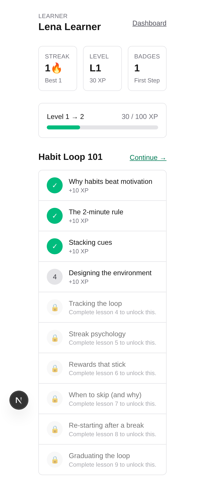
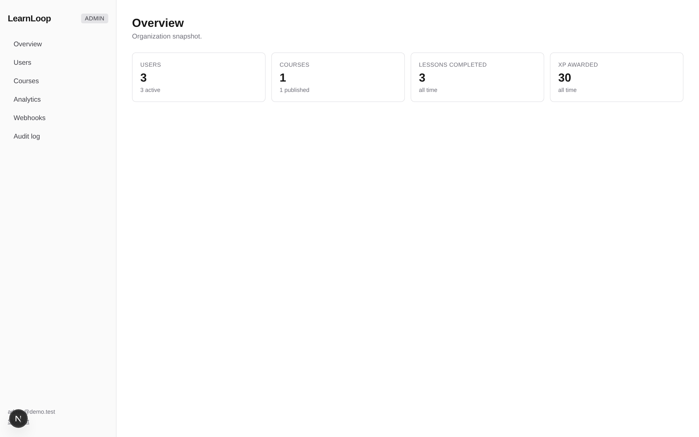
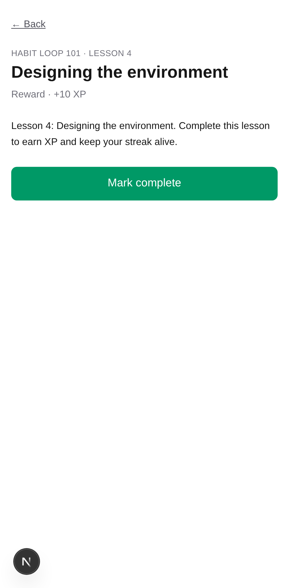
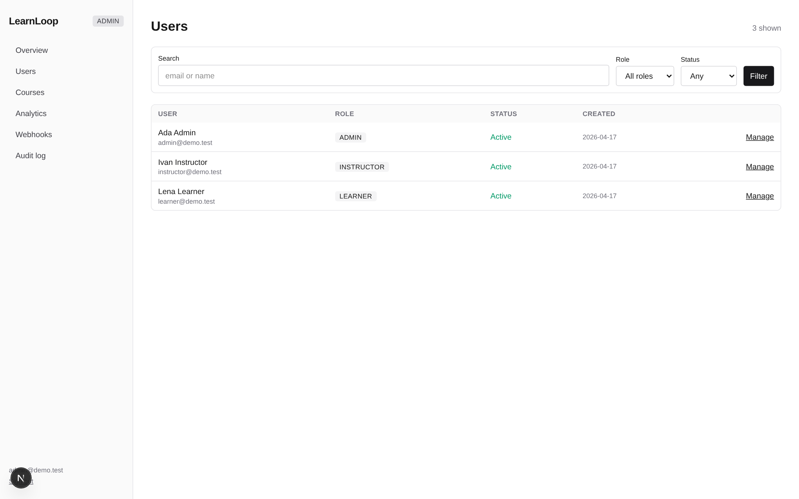
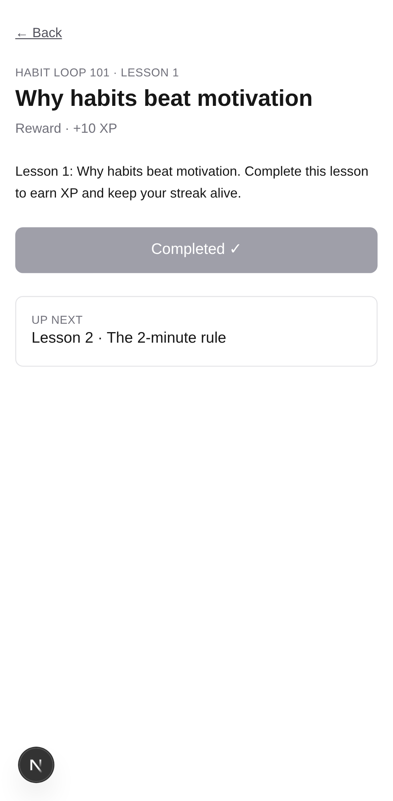
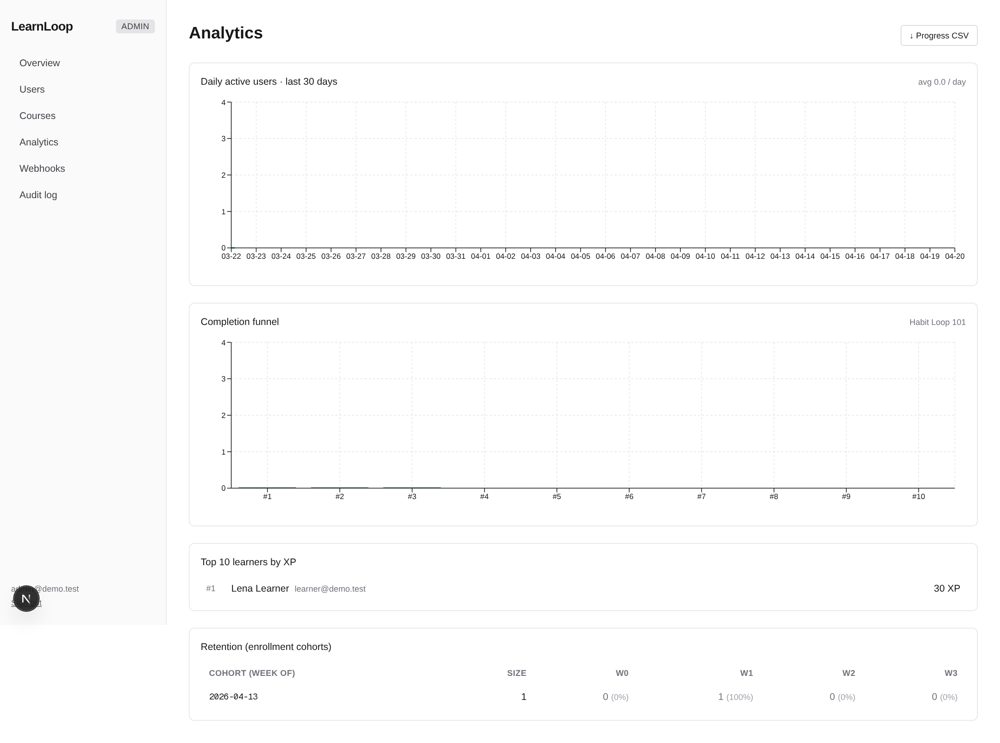
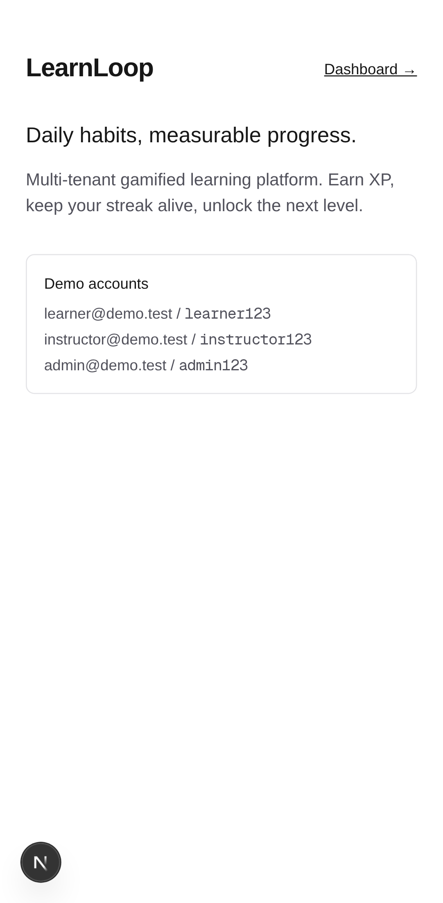
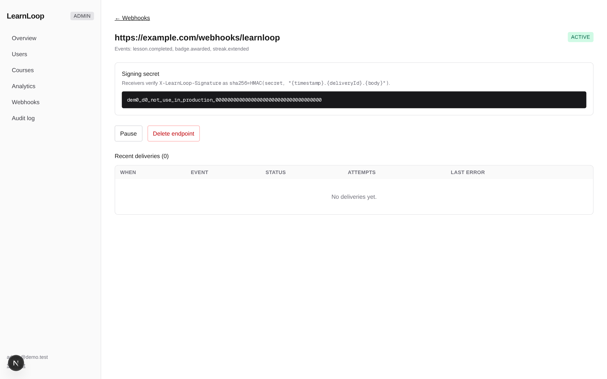
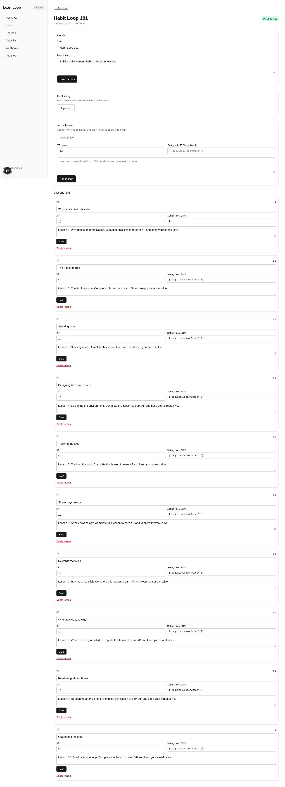
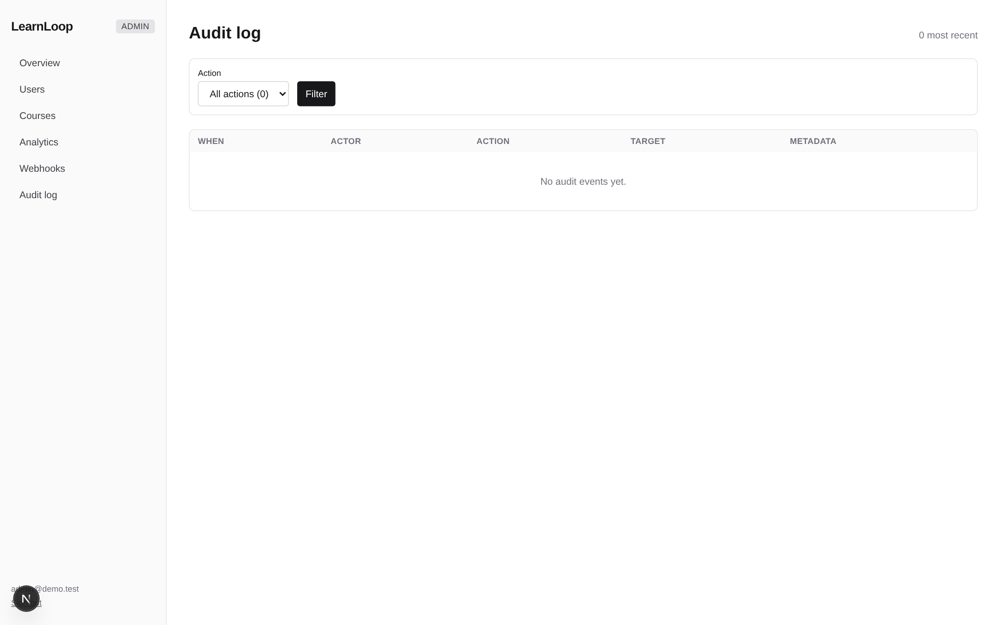

# LearnLoop

> Multi-tenant gamified learning platform. Built to demonstrate RBAC, admin panel, gamification mechanics, webhook integrations, PostgreSQL relational modeling, and mobile-first UX on Next.js 16 + Prisma.

## Explain it like I'm 13

Imagine Duolingo, but you (or your school, or your gym) can run your own copy of it.

- **Learners** open the app on their phone, see today's lesson, tap "mark complete," and watch their **streak** go up and their **XP** fill a bar. Keep showing up and you level up and earn **badges**.
- **Teachers/admins** open a desktop panel to add courses and lessons, see who's active, who's winning the XP leaderboard, and download a progress spreadsheet or a shiny PDF report card for any learner.
- **Other apps** can hook in: whenever a learner finishes a lesson, LearnLoop can send a signed message to a URL you pick (a "webhook") that says "hey, Lena just finished Lesson 3, gave her 10 XP." The signature proves the message really came from LearnLoop and wasn't tampered with.

Under the hood it's two big ideas:

1. **Rules are pure functions.** Streaks, unlocking the next lesson, and "did you just earn a badge?" are all tiny functions that take your current state in and return the new state out. Because they're pure, we can test them with dozens of tricky cases (like daylight-savings time, or someone playing at 11:59 pm then again at 12:01 am) without ever touching the database.
2. **Everything important leaves a receipt.** Every XP point is a row in an append-only ledger. Every admin action writes to an audit log. Every webhook send tracks its attempts. So if anything ever looks wrong, you can trace exactly what happened and when.

That's basically it. The rest of the README is the boring-adult version.

## Why this repo exists

Portfolio project. The brief (from a real $35-75/hr job posting) called for a SaaS dashboard with RBAC, an admin panel, outbound webhooks, and PostgreSQL. LearnLoop implements every item in that brief inside one coherent product — a gamified daily-habits learning app — so the reviewer sees how the pieces fit together, not just that each one exists.

## Stack

| Layer | Choice | Reason |
| --- | --- | --- |
| Frontend | Next.js 16 App Router, React 19, Tailwind v4 | Server components + Server Actions keep the surface area small |
| Styling | Tailwind, mobile-first | Phone-first default, desktop is the enhancement |
| Auth | Auth.js v5 (credentials + magic-link slot) | JWT carries role + tenant so middleware gates pages without a DB round-trip |
| DB | Postgres 16 + Prisma 6 | Prisma 7 has breaking changes the ecosystem hasn't caught up to |
| Gamification | Pure TS functions with Vitest | Streaks, gating, badge rules all unit-tested, including DST edges |
| Webhooks | HMAC-SHA256 signer + queue + worker | Exponential backoff + jitter, capped at 8 attempts |
| Exports | `@react-pdf/renderer`, `papaparse` | Server-rendered PDF report cards, CSV progress dumps |
| Charts | Recharts | DAU line, completion funnel bar |
| Testing | Vitest, Playwright-ready | 30 tests covering engine + signer + audit integration |

## Screenshots

| Learner (mobile, Pixel 7) | Admin (desktop) |
| :--- | :--- |
|  |  |
|  |  |
|  |  |
|  |  |
| &nbsp; |  |
| &nbsp; |  |

## Quick start

```bash
nvm use                  # Node 22 (.nvmrc)
pnpm install
pnpm db:up               # Postgres 16 via docker-compose on :5455
cp .env.example .env     # set AUTH_SECRET, WEBHOOK_DRAIN_SECRET
pnpm db:migrate
pnpm db:seed             # 1 org, 3 roles, 1 course, 10 lessons, 3 badges
pnpm dev
```

Sign in at <http://localhost:3000/login>:

| Role | Email | Password |
| --- | --- | --- |
| learner | learner@demo.test | `learner123` |
| instructor | instructor@demo.test | `instructor123` |
| admin | admin@demo.test | `admin123` |

## What you'll find

- `/` — marketing landing
- `/login` — credentials login
- `/dashboard` — role-aware hub
- `/learner` — mobile-first streak + XP + lesson list (the daily driver)
- `/learner/lessons/[id]` — lesson detail with "mark complete" → reward toast
- `/admin` — overview stats (users, courses, completions, XP)
- `/admin/users` — filterable user list + [profile](src/app/admin/users/[id]/page.tsx) with role change + disable/enable
- `/admin/courses` — list + inline create + edit + publish toggle
- `/admin/analytics` — DAU, completion funnel, top learners, retention grid
- `/admin/webhooks` — endpoint CRUD, signing secret, delivery log, per-row retry
- `/admin/audit` — every admin mutation, filterable by action

## The interesting parts

- **Gamification rules engine** — pure functions for streak (DST-safe), gating, badges, level curve, composed inside a single Prisma transaction. See **[GAMIFICATION.md](docs/GAMIFICATION.md)** — this is the hero doc.
- **RBAC in three layers** — middleware short-circuit, `requireRole()` at the page, `assertSameTenant()` at the resource. Server actions re-check because middleware doesn't run on them.
- **Webhook signer** — HMAC-SHA256 over `ts.deliveryId.body`, 5-minute timestamp tolerance, timing-safe compare. Round-trip + tamper + stale-timestamp tests in [`tests/webhook-signer.test.ts`](tests/webhook-signer.test.ts).
- **Audit log as a real API** — every admin mutation writes a typed row. The admin log viewer filters by action and groups counts, so you can see "who changed role 12 times last week" at a glance.

## Docs

- [ARCHITECTURE.md](docs/ARCHITECTURE.md) — request lifecycles + deployment topology with mermaid diagrams
- [DATA-MODEL.md](docs/DATA-MODEL.md) — ERD + indexing posture
- [GAMIFICATION.md](docs/GAMIFICATION.md) — rules engine design decisions
- [DEPLOYMENT.md](docs/DEPLOYMENT.md) — Vercel + Railway runbook

## Scripts

| Command | What it does |
| --- | --- |
| `pnpm dev` | Next.js dev server |
| `pnpm typecheck` | `tsc --noEmit` |
| `pnpm lint` | ESLint |
| `pnpm test` | Vitest (30 tests) |
| `pnpm build` | Production build |
| `pnpm db:up` | docker-compose Postgres up |
| `pnpm db:migrate` | Apply Prisma migrations (dev) |
| `pnpm db:reset` | Drop + re-migrate + seed |
| `pnpm db:seed` | Re-run demo seed |
| `pnpm db:studio` | Prisma Studio |
| `pnpm exec tsx scripts/smoke-complete.ts` | E2E gamification smoke |
| `pnpm exec tsx scripts/smoke-exports.ts` | E2E CSV + PDF smoke |
| `pnpm exec tsx scripts/smoke-webhooks.ts` | E2E signed webhook fan-out + retry |

## CI

GitHub Actions runs typecheck + lint + tests + build on every push (see [.github/workflows/ci.yml](.github/workflows/ci.yml)).

## Status

Phase 5 (polish + deploy) — in progress. Phases 1-4 shipped: scaffold, gamification engine, admin panel, analytics + exports + HMAC webhooks.

## License

Source-available for portfolio review. Not currently open-source licensed.
