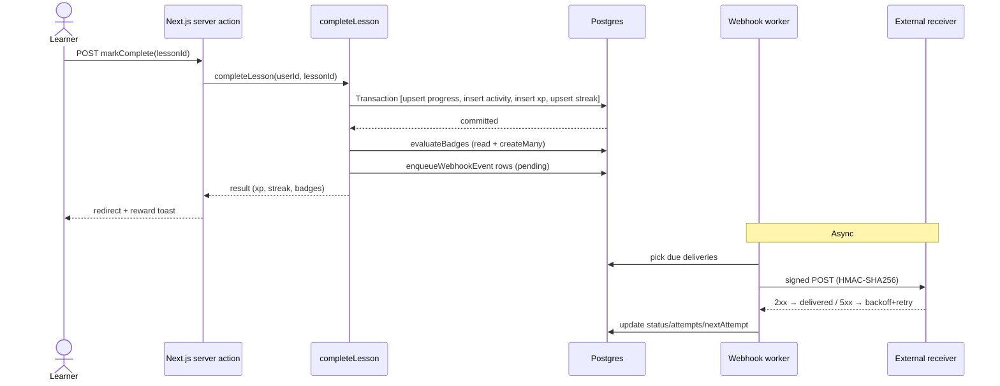
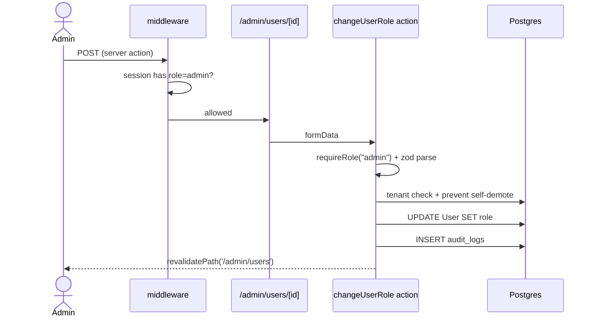

# Architecture

## High level

```mermaid
flowchart LR
  subgraph Clients
    L[Learner mobile-first web]
    A[Admin panel - desktop responsive]
  end

  subgraph App["Next.js 16 app (Vercel)"]
    MW[middleware.ts - RBAC gate]
    Pages[App Router pages]
    Actions[Server Actions + Route Handlers]
    Engine[Gamification engine]
    Webhooks[Webhook signer + worker]
    PDF[@react-pdf/renderer]
    CSV[papaparse]
  end

  subgraph Data["Postgres 16 (Railway)"]
    Core[(Core tables)]
    Audit[(audit_logs)]
    Hooks[(webhook_deliveries)]
  end

  External[Receiver endpoints]

  L --> MW --> Pages
  A --> MW --> Pages
  Pages --> Actions --> Engine
  Actions --> PDF
  Actions --> CSV
  Engine --> Core
  Actions --> Audit
  Engine --> Hooks
  Webhooks -->|HMAC POST| External
```

## Request lifecycles

### Learner completes a lesson



### Admin changes a user's role



## Multi-tenancy

Every tenant-scoped table has an `organizationId FK`. Every admin query filters by `organizationId`. `assertSameTenant(user, resource)` is called whenever a resource is loaded by arbitrary id.

Two-tenant isolation test: log in as an admin from org A, try to visit `/admin/users/<user-from-org-B>` → 403 via `assertSameTenant`.

## Auth

Auth.js v5 with a credentials provider + JWT sessions. The JWT carries `uid`, `role`, and `organizationId`, so role gating runs in middleware without a DB round-trip. A database-backed session table and magic-link provider are scaffolded in the schema for a future swap.

## Deployment topology

| Layer | Service | Why |
| --- | --- | --- |
| Frontend + server | Vercel | First-party Next.js host; free tier covers the demo |
| Postgres | Railway | Managed Postgres 16 with a single-click fork for staging |
| Observability | Sentry (free) | Wired via `SENTRY_DSN`, no-op if unset |
| Webhook retries | Vercel Cron → `/api/webhooks/drain` | Shared-secret pull instead of a durable queue |

The drain endpoint is a simple `POST /api/webhooks/drain` that processes up to N due deliveries per call. A cron service hits it on a schedule. This keeps the entire stack in two managed services — the portfolio story avoids a "look, I can wire Redis + BullMQ" distraction.

## Non-goals (recorded here so nobody argues for them in review)

- No video hosting — lessons link out
- No payments
- No CMS / content authoring UI (seeded via script + admin form)
- No native mobile apps
