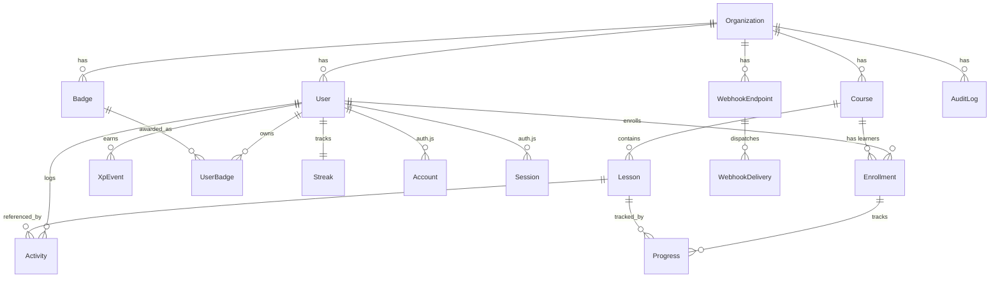

# Data model

## Entity-relationship diagram

## Scope of each table

| Table | Grain | Notes |
| --- | --- | --- |
| `organizations` | The tenant | Every other non-auth table roots here |
| `users` | One per person per org | `role enum(learner, instructor, admin)` |
| `courses` | One per course per org | Unique `(organizationId, slug)` |
| `lessons` | One per lesson per course | Unique `(courseId, order)`; `gatingRule` JSON |
| `enrollments` | One per user-course pair | Unique `(userId, courseId)` |
| `progress` | One per enrollment-lesson pair | `completedAt` nullable until done |
| `activities` | Append-only ledger | Drives DAU + retention queries |
| `xp_events` | Append-only delta ledger | Totals are `SUM(delta)` |
| `badges` | Catalog per org | Rule as Zod-discriminated JSON |
| `user_badges` | Award ledger | Unique `(userId, badgeId)` |
| `streaks` | One per user | `current`, `longest`, `lastActivityUtc` |
| `webhook_endpoints` | One per receiver per org | HMAC secret per endpoint |
| `webhook_deliveries` | One per event-endpoint pair | Status + attempt counter |
| `audit_logs` | Append-only admin action log | Scoped per tenant |

## Indexing posture

- `users (organizationId)` and `users (role)` — list filters in the admin panel
- `lessons (courseId)` unique with `order` — ordered list access + gating lookup
- `enrollments (userId, courseId)` unique — dedup + learner-view join
- `progress (enrollmentId, lessonId)` unique — dedup + idempotent completion
- `activities (userId, createdAt)` — DAU bucket
- `xp_events (userId, createdAt)` — timeline
- `webhook_deliveries (endpointId, status)` and `(status, nextAttempt)` — worker picks
- `audit_logs (organizationId, createdAt)` — admin browsing

## Migrations

Prisma manages the schema. Every schema edit runs through `pnpm db:migrate` which:

1. Generates a SQL migration in `prisma/migrations/`
2. Applies it to the dev database
3. Regenerates the typed Prisma Client

CI re-applies the full chain via `prisma migrate deploy`.

## Things that would change for v2

- Add `Postgres RLS` policies keyed on `app.current_tenant` (set per request) for defense-in-depth
- Promote the `gatingRule` JSON to a typed enum of rule structures once the shape stabilizes
- Partition `activities` by month if the table grows past ~10M rows
